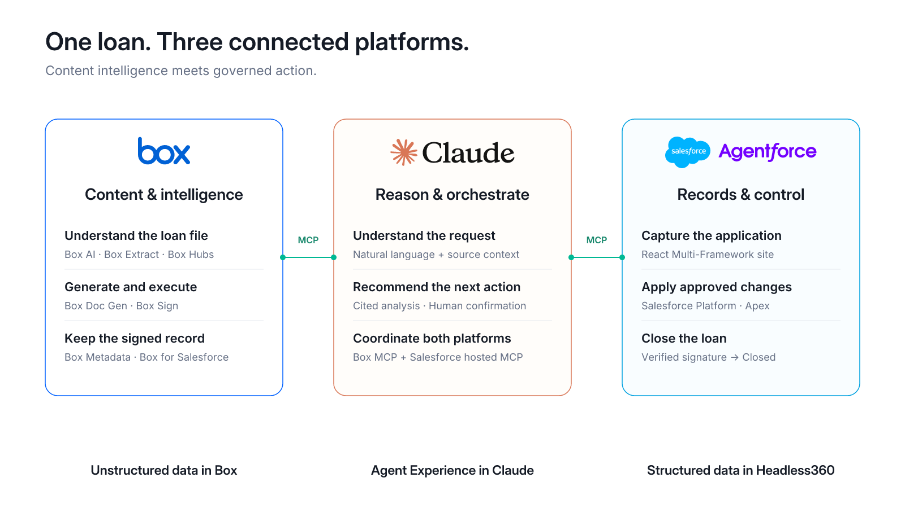
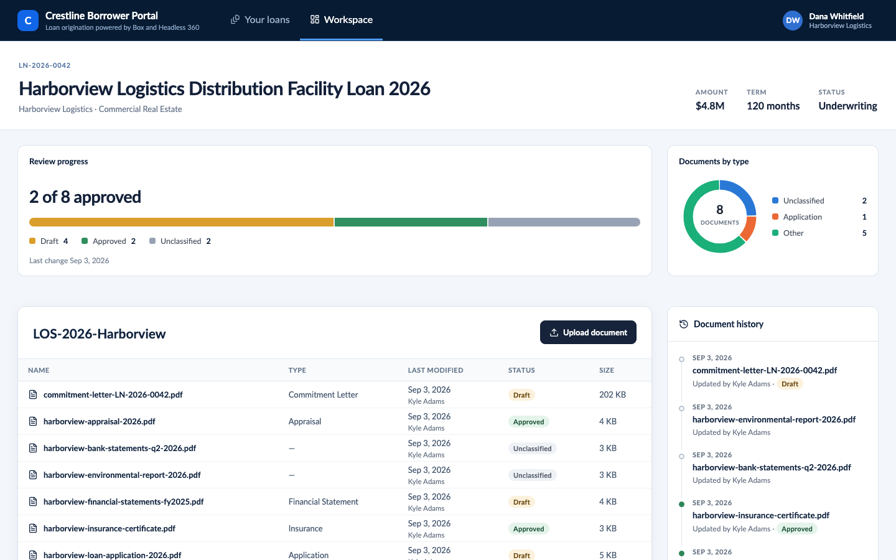

# Loan Origination Demo

Commercial loan origination demo showcasing Box + Salesforce integration with AI-powered workflows.



*The demo works headlessly across Claude Desktop, Amazon Quick, Slack, ChatGPT, and Agentforce — same Box + Salesforce backend, different AI harnesses.*



*Acme Bank Borrower Portal — Commercial loan workspace showing document checklist, Box-integrated file management, and AI-powered workflows.*

## What It Does

A borrower applies through the Acme Borrower Portal. Documents uploaded to Box are automatically classified by Box AI. A loan officer's AI assistant:

- Extracts loan terms from marked-up documents
- Validates terms against credit policy (stored in Box Hubs)
- Reviews borrower's loan history
- Generates commitment letters via Box Doc Gen
- Enforces governance (status checks, confirmation requirements)

**Key features:**
- Governed loan files in Box, structured records in Salesforce
- Box-confirmed signature completion closes the loan; signed letters and signing logs remain available in the borrower workspace
- Box AI for document classification and term extraction
- Credit policy validation via Box Hubs
- Headless AI integration (works with Claude Desktop, Amazon Quick, ChatGPT, Slack, Agentforce)
- Multi-connector strategy: Box MCP for Box operations, LOS tools for Salesforce governance

## Quick Start

### Prerequisites

- Box enterprise with AI, Hubs, Doc Gen, Sign, and metadata enabled
- Salesforce org with Agentforce and [Multi-Framework](https://help.salesforce.com/s/articleView?id=sf.exp_cloud_multiframework.htm) (Hyperforce required)
- Box for Salesforce package installed
- Python 3.11+, Node.js, Box CLI, Salesforce CLI

### Setup

```bash
# 1. Configure environment
cp .env.sample .env
cp config/runtime/demo-environment.example.json config/runtime/demo-environment.json
python3 scripts/setup_los_dev.py

# 2. Deploy to Salesforce and Box
python3 scripts/demo_operator.py bootstrap --scenario box-salesforce-los --yes
./scripts/seed-los-sample-data.sh <alias>
./scripts/seed-los-loan-files.sh <alias>
```

**Next Steps:**
- **Admin setup**: Configure Box preview and Loan Copilot → [SETUP.md](docs/SETUP.md)
- **Presenter setup**: Connect your AI client → [CLIENT-SETUP.md](docs/CLIENT-SETUP.md)

## Running the Demo

### For Presenters

**📖 [Public Demo Guide](https://unofficialbox.github.io/box-claudeforce-loans/)** - Interactive HTML storyboard with screenshots and step-by-step instructions

**🔗 [Borrower Portal](https://agentforce-box.my.site.com/loansvforcesite/login)** - Acme Bank demo portal (sign in as Dana Whitfield)

### AI Client Setup

Works with any AI harness - choose your platform:
- **Claude Desktop**: [Setup instructions](docs/CLIENT-SETUP.md#claude-desktop)
- **Amazon Quick**: [Setup instructions](docs/CLIENT-SETUP.md#amazon-quick)
- **Slack**: [Setup instructions](docs/CLIENT-SETUP.md#slack)
- **ChatGPT**: [Setup instructions](docs/CLIENT-SETUP.md#chatgpt)

### Demo Materials

- **[Presenter Guide](docs/PRESENTING.md)** - Tips for delivering the demo
- **[Demo Clickpath](DEMO-CLICKPATH.md)** - Beat-by-beat prompts and walkthrough

### Cleanup Between Demos

```bash
# Preview deletions
python3 scripts/cleanup_demo.py --status Application --dry-run

# Delete all test loans
python3 scripts/cleanup_demo.py --status Application --yes
```

## Documentation

### Setup & Configuration
- **[SETUP.md](docs/SETUP.md)** - Complete deployment guide
- **[CLIENT-SETUP.md](docs/CLIENT-SETUP.md)** - Connect your AI client (Claude, Quick, Slack, ChatGPT)

### Architecture & Design
- **[ARCHITECTURE.md](docs/ARCHITECTURE.md)** - System design and governance model
- **[SECURITY.md](docs/SECURITY.md)** - Authorization and token scoping
- **[CLAUDE.md](CLAUDE.md)** - AI connector strategy (metadata-first, Box MCP vs LOS tools)

## Repository Structure

- `config/` - Box metadata templates and runtime configuration
- `scripts/` - Deployment automation and helpers
- `los-salesforce-project/` - Salesforce metadata and UI components
- `sample-data/` - Credit policy library and demo documents
- `docs/` - Setup guides and architecture documentation
