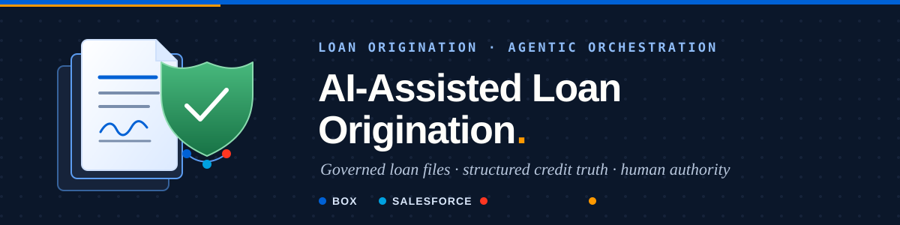

# Loan Origination Demo

> **Presenting?** Open **[`DEMO-STORYBOARD.html`](DEMO-STORYBOARD.html)** — the six-beat Harborview storyboard:
> preflight checks, every prompt as copy-paste, and what each beat should return.
> Presenting from Claude Desktop, ChatGPT or Slack? Load [`skills/los-demo/SKILL.md`](skills/los-demo/SKILL.md): the answer rules, the prompts, and the honest answers, in one file.

This repository is a commercial loan origination (LOS) demo built on **Box + Salesforce**, presented headless: the harness is whichever one the customer uses (Claude Desktop, ChatGPT, Slack, or Agentforce inside the org), and both platforms are reached through MCP connectors. It is a governed loan file in Box, a structured `LOS_Loan__c` record in Salesforce, governed Apex actions between them, and deterministic local fixtures.

**Provenance.** The implementation was ported from the Box + Salesforce contract lifecycle (CLM) demo, whose Box preview, Doc Gen, Sign preparation, MCP server and scoped external workspace were all proven against a live org. The loans port was deployed and smoke-tested live in one Box enterprise and one Salesforce org (2026-09-03): the CCG token endpoint, loan package, Box AI ask and extract, the refused unconfirmed write-back, the signature guard, portfolio search, Doc Gen template registration and the credit policy Hub all ran against real services. The Box App, Form and Automate intake surfaces remain browser tasks.

## Choose one path

| Goal | Start here |
|---|---|
| Set up a new org and Box enterprise | [Start Here](docs/operator/start-here.md), then [Box preview setup](docs/operator/box-preview-setup.md) and the [manual-task register](docs/operator/manual-task-register.md) |
| Present the demo | [`DEMO-STORYBOARD.html`](DEMO-STORYBOARD.html), the [demo clickpath](docs/operator/demo-clickpath.md), and the [presenter skill](skills/los-demo/SKILL.md) |
| Understand the domain and the architecture | [Architecture](docs/use-case-creator/architecture.md) and the [Salesforce loan record](docs/use-case-creator/salesforce-loan-record.md) |
| Maintain the code | [`HANDOFF.md`](HANDOFF.md), then [`box-salesforce-paved-path.md`](box-salesforce-paved-path.md) when something breaks |

AI assistants read this file and exactly one persona under `.claude/personas/` before exploring further.

## The scenario

Alex Bennett, Commercial Loan Officer at Acme Bank, works the Harborview Logistics loan (`LN-2026-0042`). Box remains authoritative for loan-file content; Salesforce `LOS_Loan__c` remains authoritative for structured credit truth. Loan-file bytes never flow into Salesforce, and every generation, signature and record write is human-gated.

The borrower path: a borrower signs in to the Acme Borrower Portal, starts an application, and uploads the documents the bank asks for (`config/los/required-documents.bcl`); Box AI classifies each upload against the `losDocument` template, so the lender's Copilot, the portfolio search and the borrower's own checklist read one classification, and the lender's record appears in Application status with its Box folder. Email and Box Automate intake remain an alternate path.

## Get started

Authenticate the CLIs (`box login -d`, `sf org login web`), then from the repository root:

```bash
python3 scripts/setup_los_dev.py --smoke      # probes CLI sessions, prints a simulated plan, writes nothing
python3 scripts/setup_los_dev.py              # installs dependencies and creates the runtime config
python3 scripts/validate_los.py               # the offline validation matrix
```

`setup_los_dev.py --automated --from-current-clis` preloads Box and Salesforce IDs from the authenticated CLIs into the gitignored `config/runtime/demo-environment.json`. `validate_los.py` checks secrets and runtime-ID isolation, JSON/BCL configs, Markdown links, Mermaid/SVG drift, Python and React tests, lint, build, Playwright, deterministic fixtures, the screenshot manifest, reset and idempotency rules, and the SOQL-projection-versus-permission-set check; it skips live receipts in repository mode.

For a live presenter-readiness decision, create the gitignored `config/runtime/validation-receipts.json` from its example and run `python3 scripts/validate_los.py --presenter-ready`. It fails closed unless Box and Salesforce have current secret-free passed receipts.

## Source map

| Path | Purpose |
|---|---|
| `config/` | Portable platform, scenario, operator, and runtime specifications (authored BCL; runtime JSON) |
| `docs/operator/` | Environment setup, Box preview, the manual-task register, and the demo clickpath |
| `docs/use-case-creator/` | LOS architecture and the Salesforce loan record |
| `docs/diagrams/` | Mermaid sources and synchronized SVG renders |
| `sample-data/` | The governed credit policy Markdown |
| `scripts/` | Deterministic generators, operator automation, and validation |
| `tests/` | Repository, safety, fixture, and navigation checks |
| `los-salesforce-project/` | Salesforce metadata and the Multi-Framework React UI Bundle |
| `output/` | Generated fixtures, Doc Gen templates, and demo screenshots |

Run commands from the repository root unless a guide explicitly changes directories. Keep credentials, org and enterprise IDs, and machine-specific paths out of committed files.
