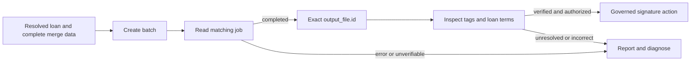

# Box Doc Gen: commitment letters

Use this contract for the Box Demo MCP `create_docgen_batch` tool. Read the connected tool schema before calling it; do not translate examples for another wrapper or the retired Apex generation action into guessed arguments.

## Resolve the inputs

- Keep the selected loan fixed throughout generation and signing. Get its record and mapped folder from `getLoanPackage`.
- Read the template file ID from the org-default `LOS_Box_Config__c.Commitment_Letter_Template_ID__c`.
- Use the current template version unless a specific version is intentionally requested. If diagnosing tags, read `GET /2.0/docgen_templates/{template_id}/tags` with `box-version: 2025.0` for that version.
- Source loan facts from Salesforce, requested terms from the term sheet, policy and exception rules from the policy library, and precedent from executed agreements. Do not turn an allowed exception into an approved exception or infer approval from a generated document.

## Complete merge payload

Replace every angle-bracket value with resolved data before calling the tool. These are instructional placeholders, not fallback text. Where a source genuinely has no value, state that accurately (for example, “No exception approval recorded”); do not invent evidence to fill a tag.

```json
{
  "file_id": "<template file ID from Salesforce configuration>",
  "destination_folder_id": "<mapped folder ID from the current loan package>",
  "output_type": "pdf",
  "document_generation_data": [
    {
      "generated_file_name": "<current loan ID>-Commitment-Letter",
      "user_input": {
        "loan": {
          "id": "<current loan ID>",
          "borrower": "<borrower from the record>",
          "loanAmount": "<amount from the record>",
          "status": "<status from the record>",
          "termSheetReference": "<source term sheet reference>"
        },
        "terms": {
          "policyAtIssue": "<applicable policy sections and citations>",
          "requestedPosition": "<borrower-requested position from the term sheet>",
          "approvedPosition": "<standard policy position with citations>",
          "exceptionPosition": "<exception rules and whether approval is actually recorded>",
          "owner": "<decision owner supported by the policy or record>",
          "risk": "<recorded risk or explicit absence of a rating>",
          "proposedTerms": "<proposed amount, rate, term and covenants supported by the analysis>"
        },
        "precedent": {
          "summary": "<prior executed agreement findings with citations>"
        },
        "letter": {
          "preparedOn": "<current preparation date>",
          "preparedBy": "<identified preparer, marked as draft when applicable>"
        }
      }
    }
  ]
}
```

All 15 paths above occur in the current template. `loan.termSheetReference` is not optional; the borrower path is `loan.borrower`. Use nested objects for dotted template paths. Do not replace `file_id` with `template_id`, `document_generation_data` with `entries`, or wrap merge values in `fields`.

The native Box REST API uses `file` and `destination_folder` reference objects; those are different from this MCP tool's `file_id` and `destination_folder_id` arguments. Both use `document_generation_data[].user_input`. [Box API contract](https://developer.box.com/reference/v2025.0/post-docgen-batches).

## Verify the output before signing

1. Retain the returned batch ID and read its jobs. Use the available connector tools or an authorized API read: `GET /2.0/docgen_batches/{batch_id}/jobs` and `GET /2.0/docgen_jobs/{job_id}` with `box-version: 2025.0`.
2. Wait for the matching job to reach `completed`. `completed_with_error` is a failed merge gate even if a PDF exists. Report `failures.errors` and `failures.warnings`. If status cannot be checked, report the blocker rather than claiming success or creating another batch.
3. Read `output_file.id` from that job, then inspect and preview that exact file. Check for unresolved `{{...}}` tags and verify the loan, borrower, amount, rate, term, and approval wording against the source record and analysis. A preview-tool error is not a successful review.
4. Use the same verified ID for the authorized signature action. The repo action accepts it as `itemId`; consult the connected tool schema for its envelope and provide the confirmed signer. Let the action enforce loan eligibility.

Never select the output by a filename, duplicate suffix, newest timestamp, metadata query, or an ID remembered from a previous attempt. Metadata search remains useful for discovering source documents, but job output is authoritative for generation results.



## Diagnosis and retry

- Missing-value warnings identify a mismatch between template paths and the data Box received. Capture the actual submitted `document_generation_data[].user_input`; a narration that the payload was correct is not evidence.
- Box's tags endpoint reports recognized paths. Dotted tags such as `{{loan.id}}` are supported. Do not prescribe re-tagging merely because visible placeholder text remains. [Template tag reference](https://support.box.com/hc/en-us/articles/36149723736723-Template-Tags-Reference).
- Before retrying, identify and correct the specific input/schema error. Do not alternate speculative formats or repeat unchanged requests. On timeout, inspect the existing batch first.
- A retry creates its own job and output file; discard the prior attempt's file ID from the signing handoff. It does not repair an existing signature request.
- If an unfilled document was already sent for signature, identify the affected request and use the user's authorization to cancel/replace it. Do not silently delete files, cancel requests, or send another request.
