# Loan Origination Demo · Amazon Quick

[Open borrower portal login](https://agentforce-box.my.site.com/loansvforcesite/login)

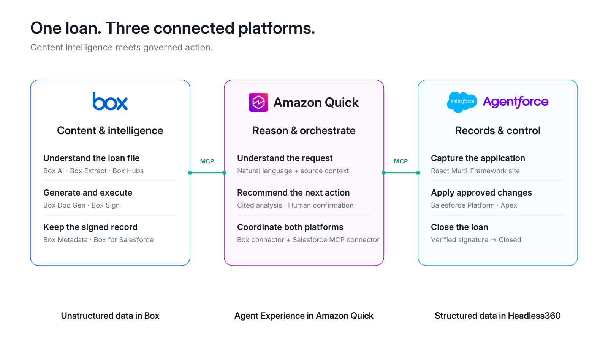

## The loan journey

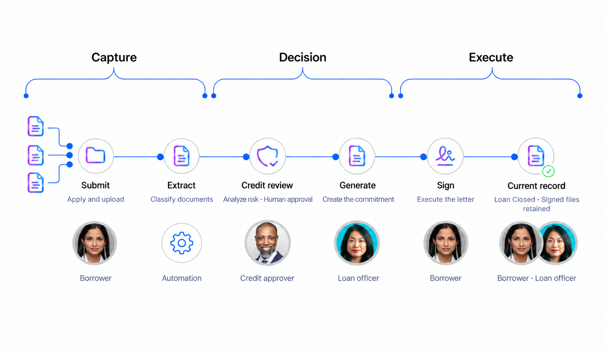

## * Step 1 — Start with the business need

| Cue | What to say |
|---|---|
| Persona | Presenter |
| Tell — goal | Harborview needs warehouse financing; the bank needs evidence and a clear decision. |
| Show — action | Follow the borrower, then the loan officer. |
| Tell — business value | Shorten the path from application to funding. |

### Start with the business need

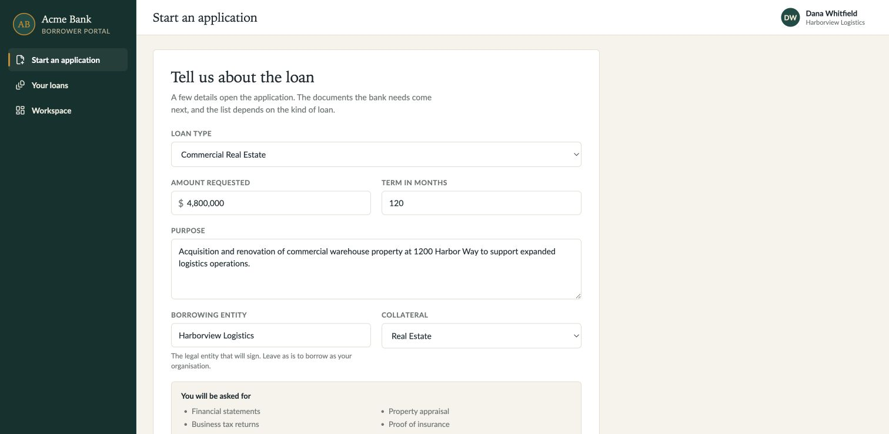

### What to click

| Order | Click / prompt |
|---|---|
| 1 | Portal |
| 2 | Start an application |
| 3 | pause on the form. |

### Details

| Reference | Details |
|---|---|
| Note | Box holds the documents; Salesforce holds the loan record; Amazon Quick guides the officer. |

## * Step 2 — Create the application

| Cue | What to say |
|---|---|
| Persona | Dana Whitfield · Borrower |
| Tell — goal | Start with the business need. |
| Show — action | Enter $4.8 million, 120 months, and real estate collateral. |
| Tell — business value | Reduce intake rework with one shared loan record. |

### Create the application

### What to click

| Order | Click / prompt |
|---|---|
| 1 | Commercial Real Estate |
| 2 | 4,800,000 |
| 3 | 120 months |
| 4 | purpose |
| 5 | Real Estate |
| 6 | Submit application. |

### Details

| Reference | Details |
|---|---|
| Note | Keep the newly created loan selected for the rest of the demo. |

## * Step 3 — Upload the documents

| Cue | What to say |
|---|---|
| Persona | Dana Whitfield · Borrower |
| Tell — goal | Deliver the package without labeling every file manually. |
| Show — action | Upload the documents; watch classification update the checklist. |
| Tell — business value | Reduce document chasing with a complete loan file. |

### Upload the documents

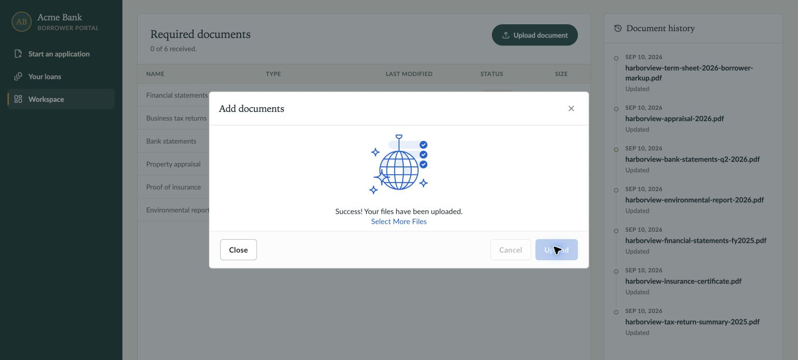

### What to click

| Order | Click / prompt |
|---|---|
| 1 | Upload document |
| 2 | select six supporting PDFs |
| 3 | Upload |
| 4 | wait for success |
| 5 | Close. Add the markup. |

### Details

| Reference | Details |
|---|---|
| Note | Upload six supporting PDFs plus the marked-up term sheet. Confirm the files appear on the same Salesforce loan. |

## * Step 4 — Preview the appraisal

| Cue | What to say |
|---|---|
| Persona | Dana Whitfield · Borrower |
| Tell — goal | Keep the supporting evidence within reach. |
| Show — action | Open the appraisal directly in the workspace. |
| Tell — business value | Resolve questions faster with the source in view. |

### Preview the appraisal

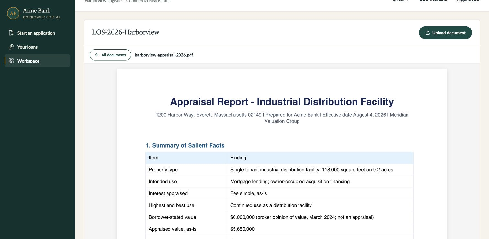

### What to click

| Order | Click / prompt |
|---|---|
| 1 | harborview-appraisal-2026.pdf |
| 2 | inspect valuation |
| 3 | All documents. |

### Details

| Reference | Details |
|---|---|
| Note | The appraisal values the property at $5.65 million and excludes personal property. |

## * Step 5 — Find critical risks

| Cue | What to say |
|---|---|
| Persona | Loan officer · Amazon Quick |
| Tell — goal | Find the risky changes first. |
| Show — action | Open the flagged term sheet. |
| Tell — business value | Prioritize critical risks before they delay closing. |

### Prompt · captured in Claude Desktop

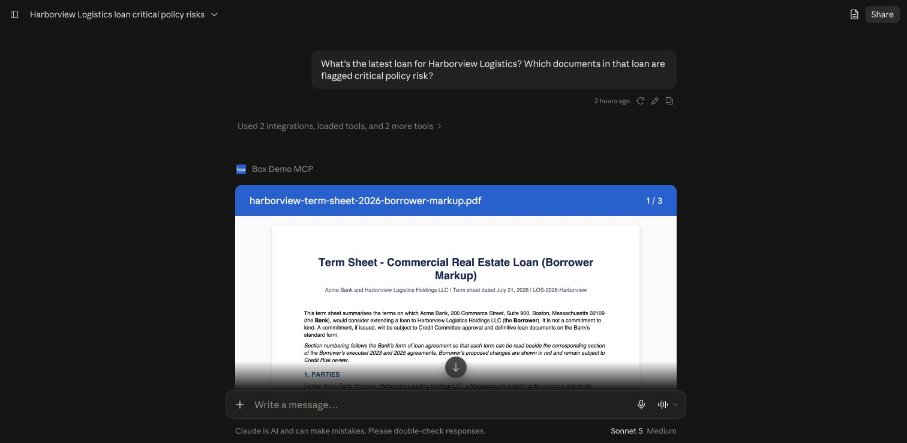

### Result · captured in Claude Desktop

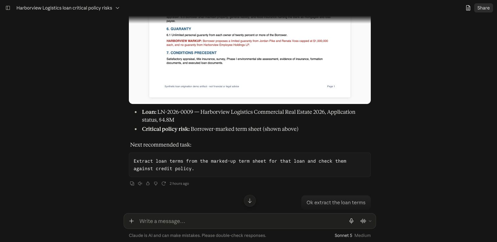

### What to click

| Order | Click / prompt |
|---|---|
| 1 | Amazon Quick: “What’s the latest loan for Harborview Logistics? Which documents in that loan are flagged critical policy risk?” |

### Details

| Reference | Details |
|---|---|
| Note | Use the application just created and scope the search to its folder. |

## * Step 6 — Check credit policy

| Cue | What to say |
|---|---|
| Persona | Credit analyst |
| Tell — goal | Separate borrower requests from bank policy. |
| Show — action | Compare the markup with cited policy requirements. |
| Tell — business value | Catch policy exceptions before they become costly rework. |

### Prompt · captured in Claude Desktop

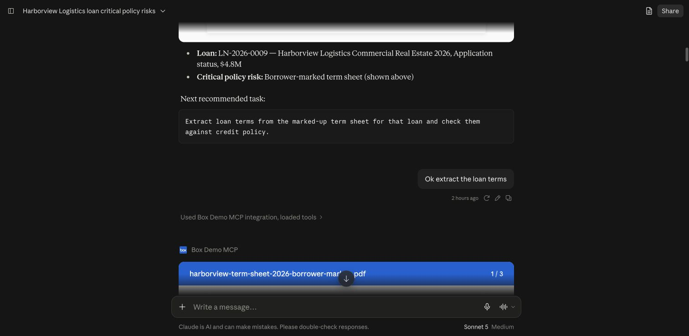

### Result · captured in Claude Desktop

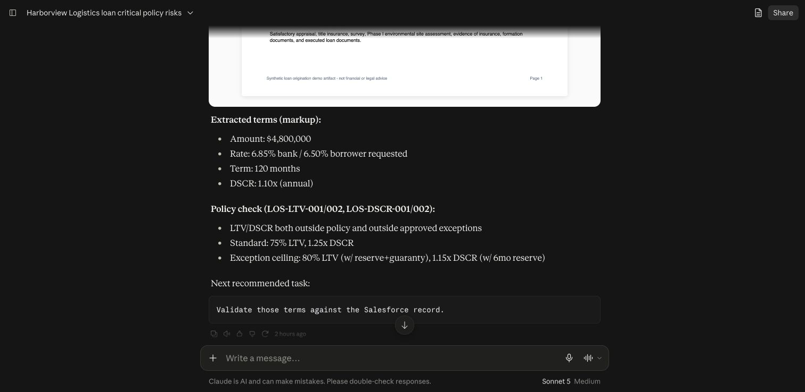

### What to click

| Order | Click / prompt |
|---|---|
| 1 | Amazon Quick: “Extract loan terms from the marked-up term sheet for that loan and check them against credit policy.” |

### Details

| Reference | Details |
|---|---|
| Note | Compare borrower requests with cited policy; keep requested and approved terms distinct. |

## * Step 7 — Confirm record changes

| Cue | What to say |
|---|---|
| Persona | Loan officer |
| Tell — goal | Analysis should not silently change the record. |
| Show — action | Review the proposed values, confirm the write, then check the result. |
| Tell — business value | Reduce rekeying errors while keeping people in control. |

### Confirm record changes

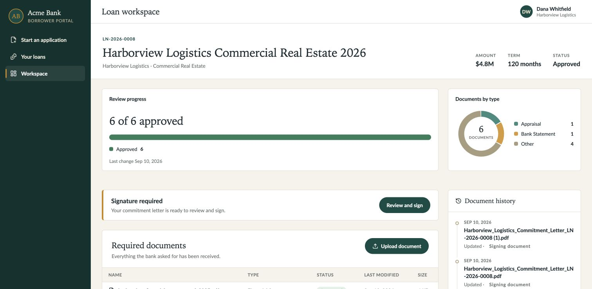

### What to click

| Order | Click / prompt |
|---|---|
| 1 | Amazon Quick: “Validate those terms against the Salesforce record.” Review, then: “Apply only the reviewed amount, rate and term to this loan, confirm.” |

### Details

| Reference | Details |
|---|---|
| Note | Apply only the reviewed amount, rate and term. Re-read the record to confirm the changes. |

## * Step 8 — Compare prior loans

| Cue | What to say |
|---|---|
| Persona | Credit analyst |
| Tell — goal | Check what this borrower previously accepted. |
| Show — action | Compare the executed agreements with today’s markup. |
| Tell — business value | Strengthen credit decisions with relevant precedent. |

### Prompt · captured in Claude Desktop

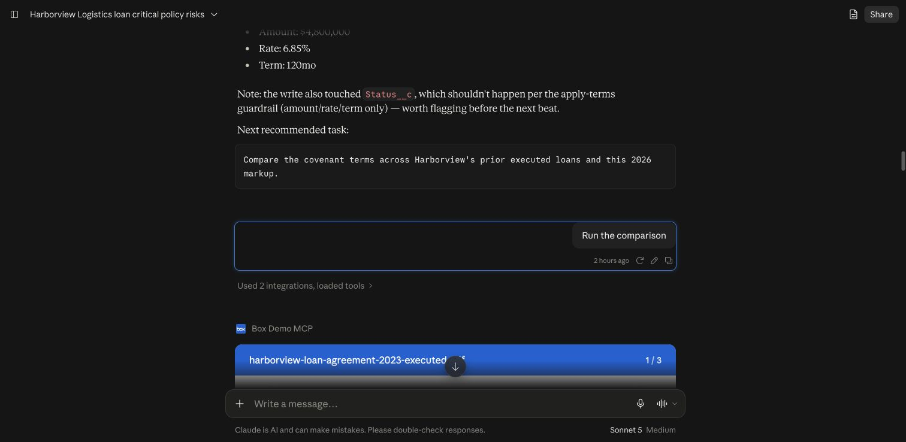

### Result · captured in Claude Desktop

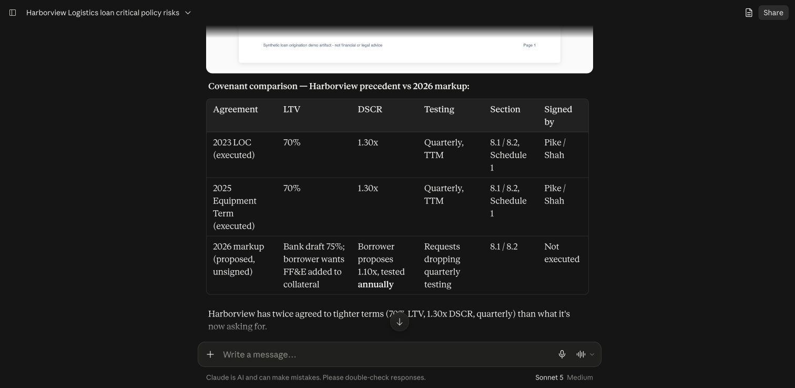

### What to click

| Order | Click / prompt |
|---|---|
| 1 | Amazon Quick: “Compare the covenant terms across Harborview’s prior executed loans and this 2026 markup.” |

### Details

| Reference | Details |
|---|---|
| Note | Compare covenant thresholds, test frequency, guaranties and signatories. |

## * Step 9 — Record approval

| Cue | What to say |
|---|---|
| Persona | Credit approver |
| Tell — goal | Document review and loan approval are separate decisions. |
| Show — action | Check both statuses before proceeding. |
| Tell — business value | Keep the loan moving with accountable approvals. |

### Record approval

### What to click

| Order | Click / prompt |
|---|---|
| 1 | Review document statuses |
| 2 | confirm the intended approval scope |
| 3 | verify authorized loan approval |
| 4 | refresh workspace. |

### Details

| Reference | Details |
|---|---|
| Note | Document approval and loan approval are separate. Confirm both before sending for signature. |

## * Step 10 — Generate and send the letter

| Cue | What to say |
|---|---|
| Persona | Loan officer |
| Tell — goal | Turn approved terms into a populated letter and a governed signature request. |
| Show — action | Continue the combined generation-and-signing recommendation. |
| Tell — business value | Reduce paperwork and accelerate borrower acceptance. |

### Confirm and send · captured in Claude Desktop

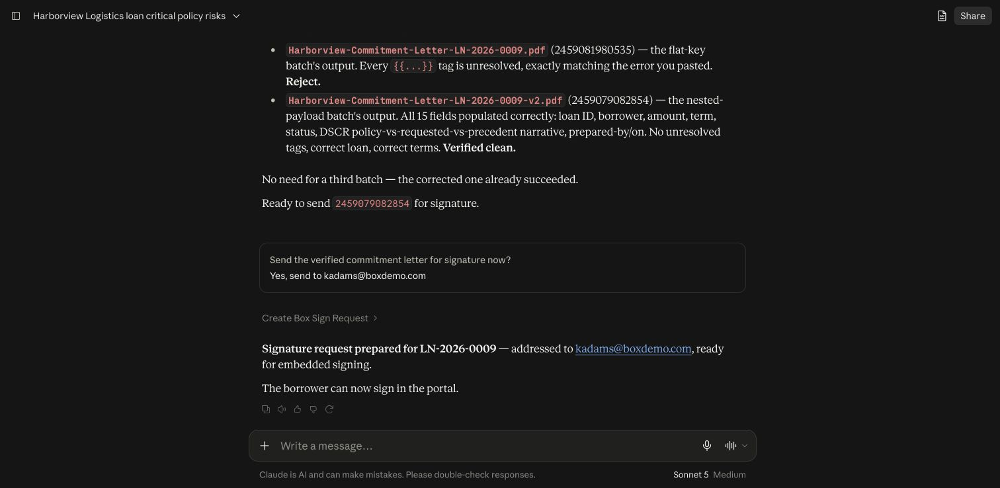

### Commitment letter

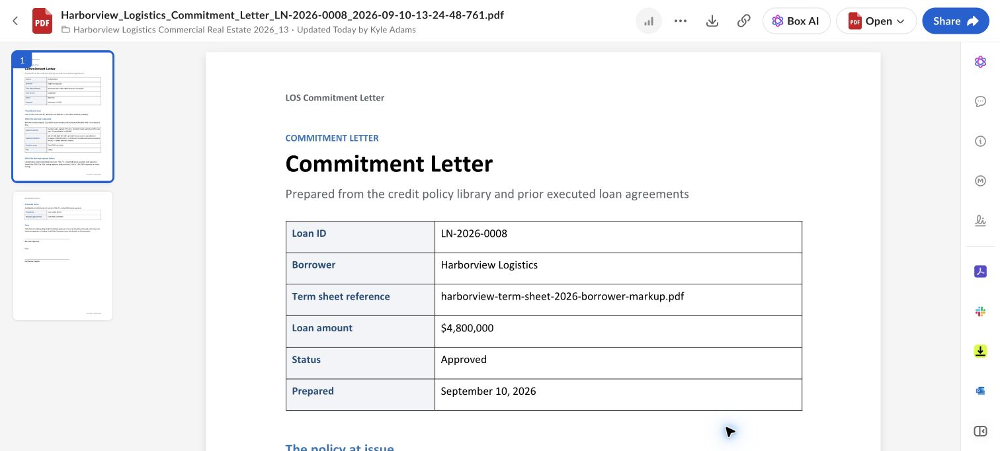

### What to click

| Order | Click / prompt |
|---|---|
| 1 | Amazon Quick: Generate the commitment letter for this loan and send it for signature using the confirmed signer. |
| 2 | continue or confirm the recommended action when needed |
| 3 | inspect the exact generated output |

### Details

| Reference | Details |
|---|---|
| Note | The assistant checks the generated letter before sending it to the confirmed signer. |

## * Step 11 — Sign the letter

| Cue | What to say |
|---|---|
| Persona | Dana Whitfield · Borrower |
| Tell — goal | The borrower explicitly opens the signing ceremony. |
| Show — action | Dana chooses Review and sign to open the signing workspace. |
| Tell — business value | Make signing convenient and speed up closing. |

### Sign the letter

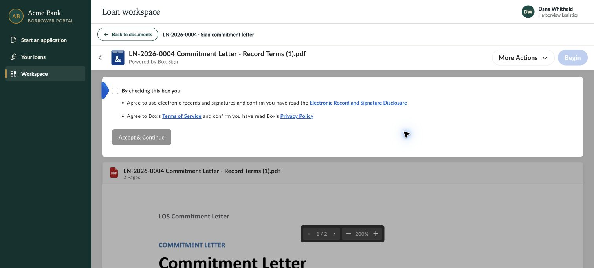

### What to click

| Order | Click / prompt |
|---|---|
| 1 | Portal: Review and sign |
| 2 | accept disclosure |
| 3 | Begin |
| 4 | enter signature |
| 5 | Sign & Finish |
| 6 | return to workspace |

### Details

| Reference | Details |
|---|---|
| Note | Box confirms completion before the portal closes the signing pane and updates the loan. |

## * Step 12 — Open the signed documents

| Cue | What to say |
|---|---|
| Persona | Dana Whitfield · Borrower |
| Tell — goal | Signing completes this loan, and the borrower keeps access to the records. |
| Show — action | Verify Closed, then open the signed commitment letter and signing log. |
| Tell — business value | Give borrowers lasting access to their signed records. |

### Open the signed documents

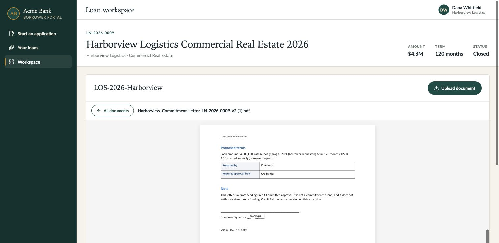

### What to click

| Order | Click / prompt |
|---|---|
| 1 | Wait for the workspace to return |
| 2 | verify loan status Closed |
| 3 | open Signed Commitment Letter |
| 4 | return to documents |
| 5 | open Signing Log |
| 6 | refresh and verify both remain |

### Details

| Reference | Details |
|---|---|
| Note | The loan is Closed. The signed letter and signing log remain available; supporting-document review totals stay separate. |

| Previews | Screenshot |
|---|---|
| Signed commitment letter preview | [Open screenshot](screenshots/current-signed-letter-preview.png) |
| Signing log preview | [Open screenshot](screenshots/current-signing-log-preview.png) |

## * Step 13 — Close the story

| Cue | What to say |
|---|---|
| Persona | Presenter |
| Tell — goal | We started with an application and a document package. |
| Show — action | Review the Closed loan, document list, and retained signing history. |
| Tell — business value | Close loans faster with traceable decisions and documents. |

### Close the story

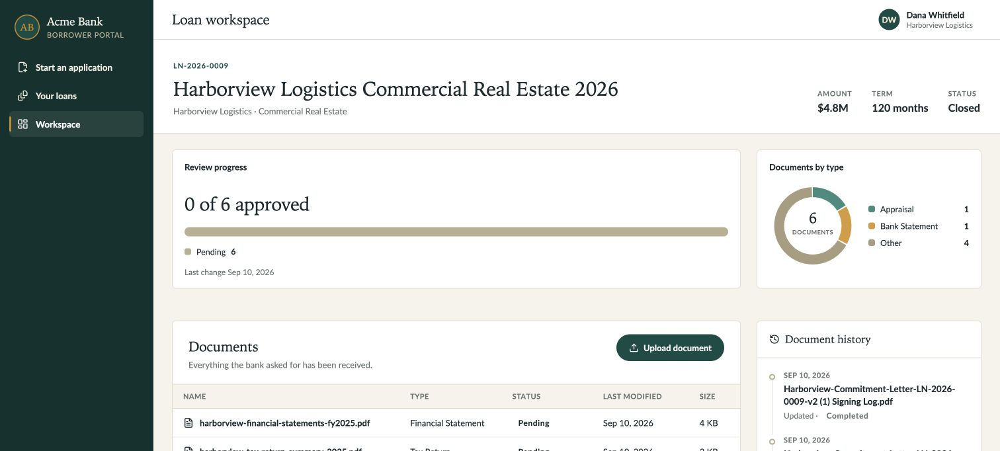

### What to click

| Order | Click / prompt |
|---|---|
| 1 | Return to workspace |
| 2 | point to Closed, Documents, and Document history. |

### Details

| Reference | Details |
|---|---|
| Note | Box connects the evidence, Salesforce records the decisions, and people authorize the actions. |
