# Box + Salesforce Loan Origination

Loan origination governed across two platforms. Box is authoritative for the loan file;
Salesforce `LOS_Loan__c` is authoritative for structured credit truth. A set of governed
Apex actions is the only path between them, and the same actions serve two very different
audiences — an internal agent surface and a borrower portal scoped to one folder.

## Read this guide in order

[1. Orientation](#1-orientation) → [2. Architecture](#2-architecture) → [3. Flow](#3-flow) → [4. Presenter script](#4-presenter-script) → [5. Visual walkthrough](#5-visual-walkthrough) → [6. Components and readiness](#6-components-and-readiness) → [7. Setup and validation](#7-setup-and-validation)

Links in **References** and the supporting React scripts are optional technical depth.

## 1. Orientation

Use this track when the question is *governance* — who may read what, who decides, and what
an agent is allowed to do on someone else's behalf.

| Boundary | Included |
|---|---|
| Internal surface | MCP server read through Claude Desktop; Agentforce Loan Copilot |
| Borrower surface | Salesforce Experience Cloud site running the React UI bundle |
| Systems | Box, Salesforce |
| Shared asset | Box Automate intake exists as the entry-point path |
| Human authority | Credit decisions, policy exceptions, commitment terms, signature |

Each operator configures their own Box app, Salesforce org and Agentforce agent. **Nothing
in this port has been run against a live environment yet**; the CLM predecessor proved the
same code path live.

[Continue to architecture](#2-architecture)

## 2. Architecture

Every read of loan-file content goes through Apex. That is what lets one implementation
serve both audiences: the Box credential never leaves the org, so an MCP client holds no
Box token and a borrower's browser holds a token scoped to a single folder.

- [Architecture source](../../../diagrams/los-architecture.mmd)
- [Shared architecture and control detail](../../../use-case-creator/architecture.md)

### Governed actions

| Action | Responsibility |
|---|---|
| Loan package | Resolves a loan from a loan id, name or record id; lists its documents with Box file ids |
| Ask a document | Box AI over one file, refused unless that file belongs to the named loan; or the credit policy Hub |
| Find documents by risk | Metadata search over `losDocument.policyRisk`, always bounded by the loans root folder |
| Extract loan terms | Box AI structured extract of amount, rate, term, collateral value, LTV, DSCR and maturity from one file of the named loan, compared to the record; reads only |
| Apply accepted terms | Writes human-accepted values to an allow-list of `LOS_Loan__c` fields; refuses without `confirmed = true` and on Closed or Servicing loans — the one governed write |
| Generate commitment letter | Box Doc Gen from a template the org owns, not one the caller chooses |
| Prepare signature | Box Sign preparation only — refuses unless the loan is Approved or Commitment, and never sends |
| Downscoped token | One folder, short-lived, minted per record for the workspace |

[Continue to flow](#3-flow)

## 3. Flow

1. The borrower signs in to the Crestline Borrower Portal, starts an application, and uploads the documents the checklist asks for; Box AI classifies each one against `losDocument`, and the record appears in Application status with its Box folder. (Email and Box Automate intake remain an alternate path.)
2. Extract pulls the requested terms onto the record with a citation per field; validation flags LTV and DSCR against the appraisal and the financials.
3. The internal reader asks how the markup compares to the credit policy library; findings cite Box files, and the library is the reference, not the model.
4. Precedent comes from what this borrower actually agreed on the loans it already closed.
5. A commitment letter is generated into the folder; signature is refused until the loan is Approved.
6. The borrower opens the same platform, scoped to their own loans and with Internal documents withheld.

- [Flow source](../../../diagrams/box-salesforce-los-flow.mmd)

[Continue to presenter script](#4-presenter-script)

## 4. Presenter script

**Duration:** 5–6 minutes for the executive path; see the
[supporting React scripts](supporting-react-scripts/README.md) for the longer variants, and
`DEMO-STORYBOARD.html` at the repository root for every prompt as copy-paste.

| Step | Tell | Show | Tell |
|---|---|---|---|
| 1. Their paper | "The borrower starts the application, and the bank tells them what it needs." | Dana Whitfield in the Crestline Borrower Portal: a Commercial Real Estate application, the seven-row required-documents checklist, an appraisal and financials uploaded and classified by Box AI, then the lender's record in Application status with its Box folder. | "Nobody picked a document type from a menu. One classification, read by the Copilot, the portfolio search and her own checklist." |
| 2. Risk | "The portfolio already knows what is risky." | A metadata search returning critical-policy-risk documents across loans. | "One query, not a folder walk." |
| 3. Policy | "Read it against the credit policy library." | Extract's validation flags LTV 85% and DSCR 1.12x; the cited answer names Section 9.3, Schedule A, `LOS-LTV-001/002`, `LOS-DSCR-001/002` and Credit Risk. | "A keyword search for loan-to-value finds nothing — the markup never uses the phrase." |
| 4. Precedent | "What did they agree the last two times?" | The 2023 and 2025 executed loan agreements: 70% LTV and 1.30x DSCR in Schedule 1 of each. | "Course of dealing is what moves a credit conversation." |
| 5. Boundary | "Put the terms on paper, then stop." | The generated commitment letter, then signature refused naming Underwriting. | "The refusal is a state check in Apex, not a prompt instruction." |
| 6. Other side | "Same platform, scoped to the borrower." | Dana Whitfield's portal: three Harborview loans, no Pinecrest, Internal documents withheld. | "Enforced by a sharing set on the borrower account and a downscoped token." |

Required language: Box governs the loan file; Salesforce governs credit truth; agents
retrieve, extract, compare, explain and draft; humans approve credit decisions, accept
extracted terms onto the record, and authorize signature.

[Continue to the visual walkthrough](#5-visual-walkthrough)

## 5. Visual walkthrough

**Screen capture pending (MT-072).** No real loan screens have been captured yet; the
gallery renders a placeholder for each of the following until they are:

- The borrower workspace for `LN-2026-0042` with the marked-up term sheet in preview.
- The Loan Origination App home: quick actions, document risk profile, the Harborview deal room, pending high-risk reviews.
- The Credit Policy Library page and the Crestline Credit Policy Library Hub.
- The Automate human-validation branch of `LOS - Loan Application Intake Enrichment`.

Optional offline presentation: [self-contained visual gallery](../../../../output/html/02-box-salesforce-los-gallery.html).
For the complete narrative, use the [portable guide](../../../../output/html/01-box-salesforce-los-guide.html).

[Continue to components and readiness](#6-components-and-readiness)

## 6. Components and readiness

| Layer | Components | Status |
|---|---|---|
| Experience | Salesforce Experience Cloud site + React UI bundle (borrower portal) | **Local deterministic fixture** — unit, lint, build and Playwright pass offline; not yet deployed |
| Salesforce | `LOS_Loan__c`, governed Apex actions incl. Extract and Apply, sharing set, permission sets | **Portable specification** — metadata and Apex tests exist; no live deploy |
| Box | Content, metadata templates, Hub, Doc Gen, Sign | **Local deterministic fixture** for the generated loan file and templates; **Portable specification** for Hub, Doc Gen and Sign |
| Internal agents | MCP server; Agentforce Loan Copilot | **Portable specification** — definitions committed; never published |
| Controls | Citations, scoped reads, human approvals, confirmed write-back, signature block | **Portable specification**; refusal paths are unit-tested |

### Component and authority rules

- Box governs the loan file, versions, metadata, the credit policy library Hub, Doc Gen,
  Sign, and audit history.
- Salesforce `LOS_Loan__c` governs structured credit context and Box references.
- Salesforce intake is designed around a `Loan_ID__c` external-ID upsert followed by
  lookup so retries cannot create duplicate records. The designed Box Automate workflow
  performs a plain record create instead, which is not idempotent; restore the upsert before
  making a duplicate-safety claim.
- Agents may retrieve, extract, summarize, compare, explain, recommend, draft, and route.
  They cannot approve a credit decision, grant a policy exception, or authorize signature.
  They write to the record only through `LosApplyLoanTerms`, and only with a person's
  explicit confirmation of the values.
- **The borrower surface carries no agent.** A Service Agent runs as its own user, not
  the person signed in, so nothing scoping the page reaches it. See the handoff for why.
- Low-confidence, unclassified, missing-owner, and inaccessible work routes to Credit
  Administration triage.

[Continue to setup and validation](#7-setup-and-validation)

## 7. Setup and validation

1. Complete [Operator Start Here](../../start-here.md) and the Box surface foundation first.
2. Complete [Box Preview Setup](../../box-preview-setup.md) so the workspace reaches live
   Box content.
3. Start the React workspace with this environment's Salesforce record ID, loan ID, and
   generated Box workspace folder ID.
4. Confirm the governed folder renders, a document previews, and no browser secret is
   present.
5. Confirm every finding carries a Box citation and every approval remains human-owned.
6. Confirm signature is refused on a loan that is not Approved or Commitment.
7. Confirm Extract writes nothing, and Apply refuses without confirmation.
8. Sign in to the site as the borrower user and confirm they see only their own
   loans, with Internal documents withheld.
9. Submit a labeled application from the portal (MT-058) and confirm the record, its
   Box folder, and the Box AI classification of one uploaded document.

### Guardrail checks

| Attempt | Required result |
|---|---|
| Request signature before approval | Refused by a state check in Apex, naming the status |
| Ask a document that belongs to another loan | Refused, whatever reference was supplied |
| Apply extracted terms without `confirmed = true` | Refused; nothing written |
| Apply terms to a Closed or Servicing loan | Refused, naming the status |
| Return a material underwriting finding without a Box citation | Block and request source evidence |
| Open the borrower workspace for another account's loan | No records returned |

### References

- [Operator setup and activation](../../start-here.md)
- [Manual-task register](../../manual-task-register.md)
- [Salesforce loan record](../../../use-case-creator/salesforce-loan-record.md)
- [Machine-readable scenario manifest](../../../../config/demo/box-salesforce-los-demo-manifest.bcl)
- [Supporting React scripts](supporting-react-scripts/README.md)

[Back to the operator run order](../../README.md)
