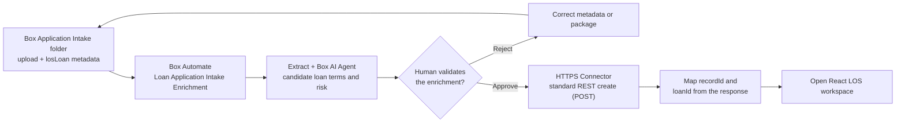

# Entry-Point Variation: Box Metadata Trigger to Salesforce Record

Use this 5–7 minute module in place of the pre-created-record opening in any LOS walkthrough. The rest of the demo continues in the same Salesforce Multi-Framework React workspace.

> **Proven vs. designed.** The CLM predecessor proved this intake end to end when it was triggered by a Box Form, then re-designed it around a metadata trigger. The loans variant carries that design with `losLoan` keys and `LOS_Loan__c` fields and has **not been run live at all**; rehearse it against a labeled test before presenting.

## Outcome

An application package is uploaded to the `01 - Application Intake` folder and the `losLoan` metadata template is applied to it. Applying that metadata triggers **LOS - Loan Application Intake Enrichment**, which runs Extract and the Box AI Agent; a human validates the proposed values, and the approved branch calls the HTTPS Connector. Salesforce creates one `LOS_Loan__c` record and returns the context needed to open React.



Rendered version: [Box metadata entry-point flow](../../../../diagrams/los-box-metadata-automate-entry.svg).

## Live anchors

| Surface | Value |
|---|---|
| Intake folder | Generated `01 - Application Intake` folder |
| Metadata template | `losLoan`, applied to the uploaded application package to trigger the workflow |
| Saved workflow | Target environment's **LOS - Loan Application Intake Enrichment** |
| Connector operation | `salesforceLoanCreate` (POST create) |
| Salesforce API | Standard sObject collection REST resource |
| Salesforce object | `LOS_Loan__c` |

Treat the workflow as inactive until the target environment's Salesforce object, origin, API version, OAuth connection, standard REST operation, and integrated smoke test are complete.

## Pre-demo setup

1. Complete [Operator Start Here](../../../start-here.md) and the integrated smoke test.
2. Use a clearly labeled non-production loan and a unique `loanId`.
3. Confirm the workflow triggers on `losLoan` metadata applied in the generated `01 - Application Intake` folder.
4. Confirm the HTTPS Connector points to the intended Salesforce test org and uses an administrator-managed OAuth 2.0 connection.
5. Have the Salesforce Loans list and React launch page open in separate tabs.
6. Obtain explicit confirmation immediately before activating the Box Automate workflow.

## Intake metadata values

Upload the Harborview application package to `01 - Application Intake`, then apply the `losLoan` metadata template with Loan ID, Amount, and Target Closing Date. Loan ID generates the Salesforce Name; the other two values populate the Salesforce record form's only required custom fields. Optional metadata stays out of the connector request when blank.

| Required metadata field | Demo value | Salesforce result |
|---|---|---|
| loanId | A unique labeled test ID (the fixture uses `LN-2026-0042`) | Name (`Loan Application - <loanId>`) and integration key |
| loanAmount | `4800000` | Amount |
| targetClosingDate | `2026-11-30` | Target Closing Date |

Borrower, applicant email, loan type, market, collateral type, owner, and other enrichment fields are optional for the demo.

## Presenter script

### 1. Apply intake metadata

Upload the application package to the `01 - Application Intake` folder, then apply the `losLoan` metadata template with the values above.

**Say**

> The process begins where the loan officer already works. Box captures the application package and its structured metadata together, so the workflow starts with governed content rather than a detached CRM record. Applying the metadata is what starts the pipeline.

Verify that the upload appears in the generated intake folder and record the created Box intake file ID.

### 2. Show Automate enrichment

Open the workflow run and show these stages:

1. **Enhanced Extract Agent** proposes structured loan fields (`loanType, riskRating, keyIssues, loanAmount, interestRate, termMonths, collateralValue, ltv, dscr`).
2. **Box AI Agent** (`LOS Loan Risk Triage`) produces a cited risk and approval brief.
3. **Approval Task** pauses processing for human validation.

Do not claim that extracted or AI-generated values are authoritative before the approval task is completed.

### 3. Validate the human gate

Inspect the proposed values and citations. Correct or reject unsupported values. For the demo, approve only after confirming the borrower, loan type, amount, market, collateral type, target closing date, loan officer, Box item references, and `loanId`.

**Say**

> Automate can prepare the record, but it cannot silently promote unreviewed AI output into Salesforce. A person validates the payload before the connector is allowed to run.

### 4. Show the HTTPS Connector handoff

> **Match this to the workflow you actually run.** The designed connector is `salesforceLoanCreate`, a plain **POST** to `services/data/{apiVersion}/sobjects/LOS_Loan__c` (`config/box/https-connectors.bcl`). Its dynamic values bind to `static.trigger.metadata.<key>`. It is **not idempotent** — re-triggering the same loan creates a second record. Do not claim duplicate-safe upsert on stage unless the org you are demoing actually runs the `salesforceLoanUpsert` PATCH path below, which remains the duplicate-safe design target.

On the approved branch, show the connector calling Salesforce. The designed path posts a new record:

```text
POST services/data/{apiVersion}/sobjects/LOS_Loan__c
```

The duplicate-safe design target instead upserts against the external-ID resource:

```text
PATCH /services/data/{apiVersion}/sobjects/LOS_Loan__c/Loan_ID__c/{urlEncodedLoanId}
```

The request contains only the allowlisted structured fields. It must not contain loan-file bytes, Box access tokens, connector secrets, signer identity details, or unreviewed AI output.

The POST create returns the new record `id`. With the PATCH upsert design, a retry with the same `loanId` would update the existing record instead of creating a duplicate.

### 5. Open the resulting workspace

Confirm the successful response returns the created record `id`:

```json
{
  "id": "<salesforce-record-id>"
}
```

Open React with the Salesforce record context plus the Box folder ID gathered from the upstream workflow:

```text
recordId=<salesforce-record-id>&loanId=<loan-id>&folderId=<generated-workspace-folder-id>
```

Then continue with the [executive walkthrough](01-executive-walkthrough.md) or the [technical validation](03-technical-validation.md).

## Pass criteria

- Applying `losLoan` metadata in the intake folder starts the workflow.
- Extract and the Box AI Agent complete before the human approval gate.
- Rejection does not call Salesforce.
- Approval calls only the configured standard REST create operation through the HTTPS Connector.
- Salesforce creates exactly one `LOS_Loan__c` record for the `loanId`.
- The response supplies the created record `id`.
- React opens with the returned Salesforce record and authoritative Box workspace context.
- Loan documents remain in Box.

## Reset

1. Record the triggering file ID, workflow run ID, and Salesforce record ID.
2. Disable the workflow after the rehearsal if it should not remain active.
3. Delete only the clearly labeled test Salesforce record if the org reset policy permits it.
4. Preserve the Box content and workflow history when audit evidence is part of the demonstration.
