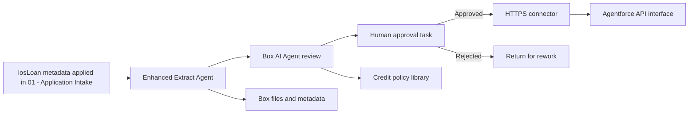

# Architecture: Box + Agentforce + React for LOS

## Design Principles

1. **One content foundation** - Box stores the loan file: application package, borrower documents, appraisal, term sheets, credit memos, commitment letters, executed loan agreements, signatures, metadata, versions, and audit trail.
2. **One presenter path** - Box + Salesforce Loan Origination presents the borrower portal and the internal Loan Copilot / MCP surface over the governed Box foundation.
3. **Human accountability** - AI drafts, summarizes, compares, extracts, and recommends. Humans approve credit decisions, policy exceptions, accepted terms, signatures, and covenants.
4. **Composable integrations** - Box is the system of record for unstructured content, Salesforce for structured credit data, and each domain system for its own governed analytics context.
5. **Reusable demo factory** - Domain demos reuse the same abstraction layers, metadata conventions, agent patterns, and handoff workflow; this vertical was itself ported from the CLM demo.

---

## Box Content and Automation Layer

### Box Objects

| Object | Purpose |
|--------|---------|
| `01 - Application Intake` folder | Application packages entering via the `losLoan` metadata trigger |
| `02 - Borrower Documents` folder | The borrower's own package: application, financial statements, tax returns, bank statements, appraisal, insurance |
| `03 - Underwriting` / `04 - Credit Approval` / `05 - Closing` folders | Internal credit memos, committee packets, and closing sets by stage |
| `06 - Executed Loan Documents` folder | Signed loan agreements and commitment letters with retention and maturity metadata |
| `07 - Covenants and Servicing` folder/view | Post-closing covenant tests, insurance renewals, inspections, maturity notices, and owner assignments |
| `Credit Policies` folder | Approved lending standards and approved exceptions as Markdown |
| `Acme Credit Policy Library` Hub | Curated publication surface for approved policy Markdown files and governance guidance |

### Metadata Templates

| Template | Scope | Example Fields |
|----------|-------|----------------|
| `losLoan` | Loan workspace folder | loanId, borrower, loanType, status, loanAmount, termMonths, interestRate, ltv, dscr, region, collateralType, owner, underwriter, riskRating, targetClosingDate, maturityDate, covenantReviewDate |
| `losDocument` | Files | documentType, versionStatus (`Draft, Internal, Approved, Executed` — `Internal` is withheld from the borrower), policyRisk, aiSummaryStatus, approvalStatus, signatureStatus |
| `losCovenant` | Covenant files/records | covenantType, owner, dueDate, sourceSection, status, reminderWindowDays |
| `losPolicy` | Individual Markdown policies | policyId, policyFamily, position, approvalStatus, owner, marketScope, lastReviewed, nextReview, usageCount |
| `losUnderwritingReview` | Comparison results (specified, not live) | baselineItemId, comparisonStatus, findingCount, highestRisk, reviewDomains, openTaskCount, lastCompared |

### Native Automate Flow



Extract and AI outputs remain draft evidence. The approval task is the control point before the connector invokes Salesforce standard REST. Bind the Salesforce origin, API version, OAuth 2.0 connection, and payload mapping to the confirmed target org; do not invent them.

---

## Scenario: Box + Salesforce Loan Origination

Two platforms, one set of governed actions between them. Box holds the loan file; Salesforce holds structured credit truth and every path from one to the other.

Diagrams: [LOS architecture](../diagrams/los-architecture.svg) ([source](../diagrams/los-architecture.mmd)) and the [Box + Salesforce flow](../diagrams/box-salesforce-los-flow.svg) ([source](../diagrams/box-salesforce-los-flow.mmd)).

```text
┌──────────────────────────────────────────────────────────────────────────────────────┐
│                          Salesforce - governed Apex actions                          │
│                                                                                      │
│  ┌──────────┐ ┌──────────┐ ┌──────────┐ ┌──────────┐ ┌──────────┐ ┌───────────────┐  │
│  │ Loan     │ │ Ask a    │ │ Extract  │ │ Apply    │ │ Generate │ │ Prepare       │  │
│  │ package  │ │ document │ │ terms    │ │ terms    │ │ letter   │ │ signature     │  │
│  │          │ │          │ │ (reads)  │ │(confirmed│ │          │ │ (state-gated) │  │
│  └────┬─────┘ └────┬─────┘ └────┬─────┘ └────┬─────┘ └────┬─────┘ └───────┬───────┘  │
│       │            │            │            │            │               │          │
│  ┌────┴────────────┴────────────┴────────────┴────────────┴───────────────┴───────┐  │
│  │           Client Credentials Grant - the Box token never leaves Apex           │  │
│  └────────────────────────────────────────────────────────────────────────────────┘  │
└──────────────────────────────────────────────────────────────────────────────────────┘
        ▲                                                              ▲
        │ MCP / Agentforce (internal)             downscoped token (borrower portal)
```

### System Roles

| System | Data Type | Access Pattern |
|--------|-----------|----------------|
| Box | Loan file, term sheets, appraisals, signatures, credit policy library | MCP/API read-write with metadata and events |
| Salesforce | Opportunity, borrower account, loan terms, credit approval state, maturity date | API read-write with event triggers; one allow-listed, confirmed write from agents |
| Box audit trail | File versions, metadata changes, task and comment history | Append-only observability |

---

## Event-Driven Flow

```text
Box metadata trigger / Salesforce Opportunity Event
        │
        ▼
Intake
        │
        ├──► Box: create workspace, apply metadata, collect the application package
        ├──► Salesforce: read opportunity, borrower account, relationship history
        │
        ▼
Underwriting Risk Agent
        │
        ├──► Extract terms; compare markup to the credit policy library
        ├──► Score policy risk (LTV, DSCR, pricing, guaranty)
        └──► Draft the approved-exception position and precedent
        │
        ▼
Credit Approval Agent
        │
        ├──► Route findings to Credit Risk, Collateral, Compliance, Loan Documentation
        └──► Block commitment and signature until Credit Committee approves
        │
        ▼
Box Sign + Covenant Monitor
```

---

## Abstraction Layers for Faster Demo Creation

| Layer | Reusable Interface | LOS Example | Vertical Swap |
|-------|-------------------|-------------|---------------------|
| Demo scenario | Persona, business object, high-stakes workflow | Commercial loan application | Asset campaign, government case file, claim, negotiated agreement, portfolio review |
| Content schema | Folder template + metadata templates | Loan workspace, documents, covenants | Asset library, evidence packet, policy, agreement set |
| Scenario model | Workflow-directed or supervisor-directed agentic orchestration | Box Automate-led intake plus governed Apex actions | Preserve the same distinction |
| Agent roles | Intake, classify, risk, approve, monitor | Application intake, policy risk, credit approval, covenants | Rename to domain-specific roles |
| System connectors | Content, CRM | Box, Salesforce | Box plus domain systems |
| Sample data | Synthetic PDFs + JSON records | Application, financials, appraisal, term sheet, executed loan agreements | Domain-specific records and files |
| Runtime state | Gitignored environment and bootstrap bindings | Box App, metadata, agents | Same portable binding model |

---

## Failure Handling

| Scenario | Recovery Strategy |
|----------|-------------------|
| Missing application document (appraisal, financials, insurance) | Intake agent creates task for the applicant and pauses downstream review |
| Low-confidence term extraction | Escalate to the underwriter with source page reference; nothing is applied to the record |
| Conflicting CRM and document values (borrower-stated collateral vs appraisal) | Validation flags the field; a person accepts or corrects before Apply |
| Approval timeout | Escalate to owner and update dashboard SLA status |
| Box Sign failure | Retry and create manual signature fallback task |
| Agent output conflicts with credit policy | Guardrail blocks recommendation and asks for Credit Risk review |

---

## Box Entry-Point Path

The alternate, metadata-triggered intake. Automate owns the intake sequence, agents enrich individual steps, humans own approvals; the React workspace opens on the record it creates. It is specified in `config/box/automate-workflows.bcl` and has not been built in a live enterprise; the borrower portal is the intake the demo shows.

### Entry-point rules

| Rule | Implementation |
|---|---|
| Box remains authoritative | Live Box workspace, file, metadata, policy, and task IDs anchor the workflow; agents cite Box sources. |
| Salesforce record creation is governed | Only validated intake reaches the standard REST create (designed) or external-ID upsert and lookup (duplicate-safe target). |
| Agentforce does not decide | Credit decisions, policy exceptions, and signature authorization remain human actions. |
| Routing is deterministic | Domains resolve through `config/los/expert-routing.bcl`; low-confidence, unclassified, inaccessible, and unconfigured assignments go to Credit Administration triage. |
| Tasks are consolidated | The routing action creates or reuses one open task per loan, application file, and domain. |
| Mutations are explicit | DocGen file creation requires presenter confirmation; applying extracted terms requires `confirmed = true`; signing stays blocked until the loan is Approved or Commitment. |
| No external agent runtime in intake | Intake itself sends no request to an external agent runtime or custom middleware. |

Workflow specification: [`config/box/automate-workflows.bcl`](../../config/box/automate-workflows.bcl)

Agent specification: [`config/agentforce/los-react-agentforce-spec.bcl`](../../config/agentforce/los-react-agentforce-spec.bcl)

---

## Monitoring

| Signal | Target |
|--------|--------|
| Intake-to-workspace creation time | Under 2 minutes |
| Term extraction confidence | 85%+ for standard commercial loans |
| Credit approval SLA breach rate | Under 10% |
| Time in underwriting | 30-50% reduction after adoption |
| Application-to-commitment cycle time | 20-40% reduction for standard commercial loans |
| Metadata completeness | 95%+ for executed loan documents |
| Covenant extraction coverage | 90%+ of closed loans |
